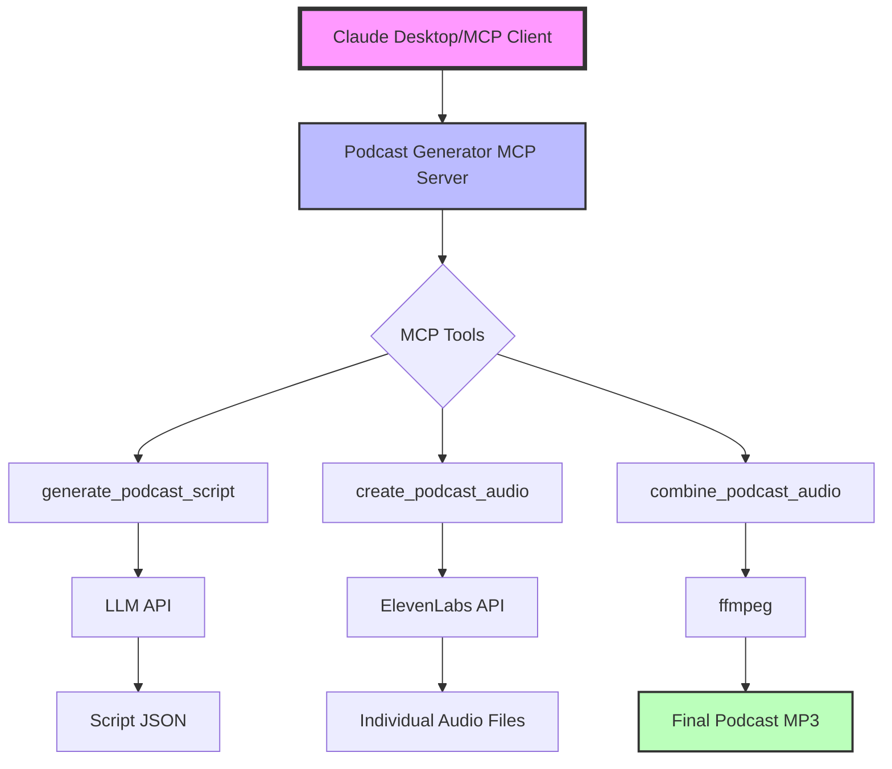

# 🎙️ Podcast Generator MCP

[](https://github.com/jlowin/fastmcp)
[](https://elevenlabs.io)
[](https://opensource.org/licenses/MIT)

A Model Context Protocol (MCP) server that creates two-sided podcasts with different AI voices. Generate engaging podcast conversations on any topic with just a few commands!

## 🏗️ Architecture



### Components

- **MCP Server**: FastMCP-based server exposing podcast generation tools
- **Script Generation**: Uses LLM to create natural dialogue scripts
- **Audio Generation**: Converts text to speech using ElevenLabs voices
- **Audio Processing**: Combines and normalizes audio using ffmpeg
- **Output Management**: Organizes all files in timestamped directories

## 🌟 Features

> **📢 New Enhanced Version Available!** Check out [ENHANCED_FEATURES.md](ENHANCED_FEATURES.md) for PDF support, background music, podcast series, and more!

### Core Features

- 🤖 **AI-Generated Scripts**: Creates natural, engaging dialogue using LLMs
- 🎭 **Multiple Voices**: Choose from 20+ different ElevenLabs voices
- 🎬 **Full Production Pipeline**: Script → Audio → Final Podcast
- 🎨 **Multiple Styles**: Conversational, interview, educational, debate
- 🔧 **Audio Processing**: Automatic normalization, fades, and transitions
- 📁 **Organized Output**: All files saved in timestamped folders

## 🚀 Quick Start

### Prerequisites

1. **Python 3.10+**
2. **ElevenLabs API Key**: Get one at [elevenlabs.io](https://elevenlabs.io)
3. **ffmpeg**: For audio processing
   ```bash
   # macOS
   brew install ffmpeg
   
   # Ubuntu/Debian
   sudo apt install ffmpeg
   
   # Windows
   choco install ffmpeg
   ```

### Installation

```bash
# Clone the repository
git clone https://github.com/adamanz/podcast-generator-mcp.git
cd podcast-generator-mcp

# Install dependencies
pip install -r requirements.txt

# Set your API key
export ELEVENLABS_API_KEY="your-api-key-here"
```

### Running the Server

```bash
# Run standard version
python podcast_mcp_server.py

# Or run enhanced version with file support
python podcast_mcp_server_enhanced.py
```

### Claude Desktop Integration

Add to your Claude Desktop config:
```json
{
  "mcpServers": {
    "podcast-generator": {
      "command": "python",
      "args": ["/path/to/podcast_mcp_server.py"],
      "env": {
        "ELEVENLABS_API_KEY": "your-key"
      }
    }
  }
}
```

## 📚 Usage Examples

### Generate a Complete Podcast

In Claude Desktop or via the MCP client:

```
"Create a 5-minute podcast about artificial intelligence"
```

### Custom Voices

```
"Generate a podcast about space exploration with Charlie as host and Emily as guest"
```

### Different Styles

```
"Make an educational podcast about quantum computing"
"Create a debate-style podcast about social media"
```

## 🛠️ Available Tools

| Tool | Description |
|------|-------------|
| `generate_full_podcast` | All-in-one podcast generation |
| `generate_podcast_script` | Create just the script |
| `create_podcast_audio` | Convert script to audio |
| `combine_podcast_audio` | Merge and process audio files |

## 🎭 Available Voices

### Male Voices
Adam, Antoni, Arnold, Bill, Brian, Callum, Charlie, Clyde, Daniel, Dave

### Female Voices
Alice, Aria, Charlotte, Domi, Dorothy, Emily, Elli, Grace, Jessie, Laura

## 📂 Output Structure

```
~/Desktop/podcast_20240610_143022/
├── script.json              # Generated script
├── 001_host.mp3            # Individual audio files
├── 002_guest.mp3
├── ...
├── silence.mp3             # Pause between speakers
├── concat_list.txt         # ffmpeg file list
├── YourPodcastTitle.mp3    # Final combined podcast
└── metadata.json           # Episode information
```

## 🔧 Advanced Usage

### Custom Personalities

```python
generate_podcast_script(
    topic="Mars Colonization",
    host_personality="skeptical scientist",
    guest_personality="enthusiastic entrepreneur"
)
```

### API Status Check

```python
# Check if everything is configured
status = await client.read_resource("status://api")
```

## 🐛 Troubleshooting

### No Audio Generated?
- Check if `ELEVENLABS_API_KEY` is set correctly
- Verify API key at [elevenlabs.io](https://elevenlabs.io)
- Check your API quota

### ffmpeg Errors?
- Ensure ffmpeg is installed: `ffmpeg -version`
- Check file permissions in output directory

### Script Generation Issues?
- Try more specific topics
- Adjust duration (3-10 minutes works best)
- Use different styles for variety

## 💡 Tips for Best Results

1. **Topics**: Be specific! "AI in Healthcare 2025" > "Technology"
2. **Duration**: 5-8 minutes is the sweet spot
3. **Voices**: Mix genders for better contrast
4. **Styles**: Match style to content
5. **API Usage**: Each minute uses ~10-15 API calls

## 🤝 Contributing

Contributions are welcome! Please feel free to submit a Pull Request.

1. Fork the repository
2. Create your feature branch (`git checkout -b feature/AmazingFeature`)
3. Commit your changes (`git commit -m 'Add some AmazingFeature'`)
4. Push to the branch (`git push origin feature/AmazingFeature`)
5. Open a Pull Request

## 📝 License

This project is licensed under the MIT License - see the [LICENSE](LICENSE) file for details.

## 🙏 Acknowledgments

- Built with [FastMCP](https://github.com/jlowin/fastmcp) by [Prefect](https://www.prefect.io/)
- Powered by [ElevenLabs](https://elevenlabs.io) AI voices
- Inspired by the Model Context Protocol community

## 📬 Support

- FastMCP Docs: [gofastmcp.com](https://gofastmcp.com)
- ElevenLabs: [elevenlabs.io/docs](https://elevenlabs.io/docs)
- Issues: [GitHub Issues](https://github.com/adamanz/podcast-generator-mcp/issues)

---

Made with ❤️ by the MCP community